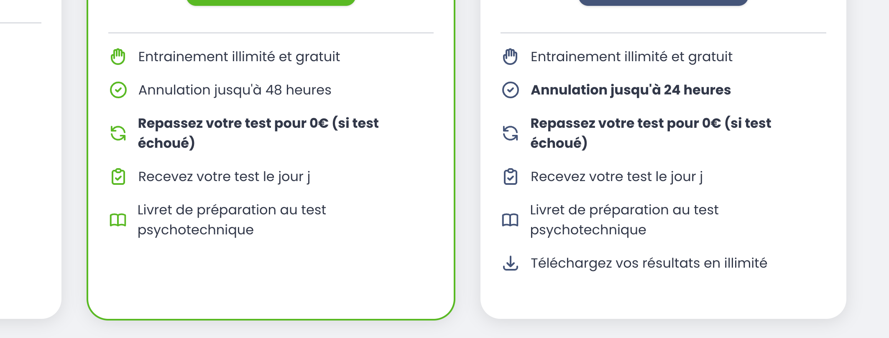

# Test technique — Dev Front

## Instructions de lancement/build

### Installer les dépendances JavaScript
```bash
npm install
```

### Lancement

1. Démarrer le serveur Laravel
```bash
php artisan serve
```

2. Dans un autre terminal, lancer Vite pour le front-end
```bash
npm run dev
```

## Liens
1. "/ravelojaona-completez-votre-reservation"
2. "/ravelojaona-paiement"

## Notes de design

### Polices de caractères
- Police principale : Poppins
- Police de fallback : Montserrat
- Fallback système : sans-serif

### Couleurs
- Vert principal : #0DBC0D
- Bleu principal : #476285
- Rose/Rouge : #C8286C
- Gris foncé : #2A2A2A

### Incohérences et arbitrages
Je n'avais pas les photos originales pour la page de paiement ni du Logo, pour cela j'ai fait des screenshoot pour chaque image et je les ai intégré dans les pages.

De même pour les icones, j'ai utilisé une source différente du projet au lieu de faire des screenchoot pour les icones par peur de déranger l'aspect globale du projet et pour garder un design plus compact et plus fluide.

## Captures d'écran comparatives

### Logo du site (image + textes)


### Section sticky recapitulatif


### Section sticky footer


### Composants
#### Card Shadow


#### Card séléctionné (border + checked icon)


#### Textes en gras


## Temps passé
Codage: 19h48 - 22h39 (2h51)
Mise au point: 5h56 - 7h00 (1h04)
Total: 3h55